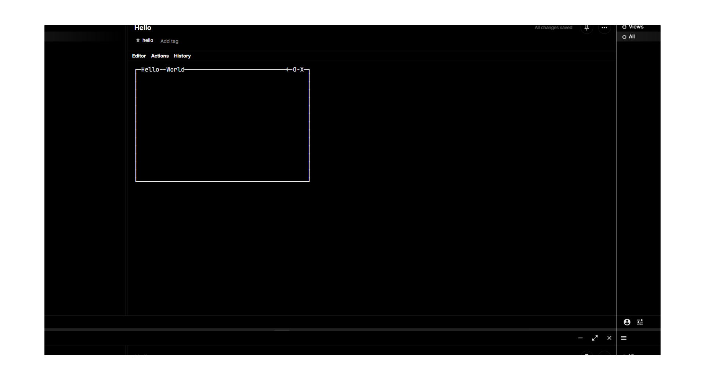

# black · · ·

> Dhruv's Black Theme for Standard Notes

Theme for [Standard Notes](https://standardnotes.org/). Based on colors from the [Greek](https://greek.dhrv.pw/).

## Install

- Copy SN | Theme Link into Standard Notes Extension Import
  `https://listed.to/p/1OiwmD0R7J`

## Info

- Latest `ext.json`

```jsonc
---
metatype: json
---

{
  "identifier": "pw.dhrv.sn-black-theme",
  "name": "Black",
  "content_type": "SN|Theme",
  "area": "themes",
  "version": "0.0.1",
  "description": "Black Theme for Standard Notes // Dhruv Suthar <hi@dhrv.pw>",
  "url": "https://cdn.jsdelivr.net/gh/0xdhrv/sn-black-theme/dist/dist.css",
  "download_url": "https://github.com/0xdhrv/sn-black-theme/archive/refs/heads/main.zip",
  "latest_url": "https://listed.to/p/1OiwmD0R7J",
  "marketing_url": "https://github.com/0xdhrv/sn-black-theme"
}
```

## Snippets


